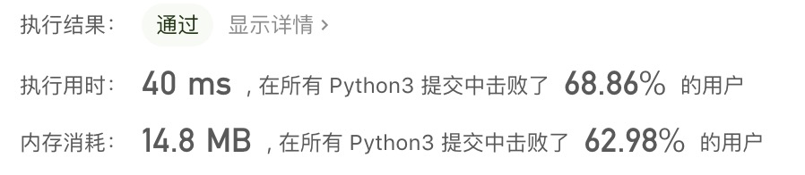
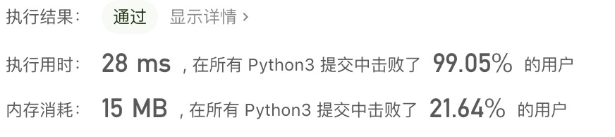

## 1 - 题目

[No.1 - 两数之和](https://leetcode-cn.com/problems/two-sum/)。

给定一个整数数组 `nums` 和一个整数目标值 `target`，请你在该数组中找出 **和为目标值** 的那 **两个** 整数，并返回它们的数组下标。

你可以假设每种输入只会对应一个答案。但是，数组中同一个元素不能使用两遍。

你可以按任意顺序返回答案。

 

**示例 1：**

```shell
输入：nums = [2,7,11,15], target = 9
输出：[0,1]
解释：因为 nums[0] + nums[1] == 9 ，返回 [0, 1] 。
```

**示例 2：**

```shell
输入：nums = [3,2,4], target = 6
输出：[1,2]
```

**示例 3：**

```shell
输入：nums = [3,3], target = 6
输出：[0,1]
```

**提示：**

- 2 <= nums.length <= $10^3$
- $-10^9$ <= nums[i] <= $10^9$
- $-10^9$ <= target <= $10^9$
- **只会存在一个有效答案**


## 2 - 思路

首先想到的是最简单的遍历，解题关键是找到 `num2 = target - num1` ，是否也在 `list` 中，那么就需要运用下面两个方法：

- `num2 in nums` ，返回 `True` 说明有戏。
- `nums.index(num2)`，查找 `num2` 的索引。

### Python题解

#### py-1 暴力解法

`num2` 的查找并不需要每次从 `nums` 中全部查找一遍，只需要从 `num1` 位置之前或之后查找即可。但为了方便，`index` 这里选择从 `num1` 位置之前查找。

```python
def twoSum(nums, target):
    lens = len(nums)
    j = -1
    for i in range(1, lens):
        temp = nums[:i]
        if (target - nums[i]) in temp:
            j = temp.index(target - nums[i])
            break
    if j >= 0:
        return [j, i]
```

LeetCode 执行结果：



运行通过，但是速度比较慢。继续想一些更高级的解决办法。

#### py-2 巧妙方法

使用哈希表，也就是散列表，在 Python 中就是字典。这种方法就是**字典记录了 num1 和 num2 的值和位置，而省了再查找 num2 索引的步骤。**

```python
class Solution:
    def twoSum(self, nums: List[int], target: int) -> List[int]:
        dct = {}
        for i, n in enumerate(nums):
            cp = target - n
            if cp in dct:
                return [dct[cp], i]
            else:
                dct[n] = i
```

LeetCode 执行结果：



### C++ 题解

待补充。

